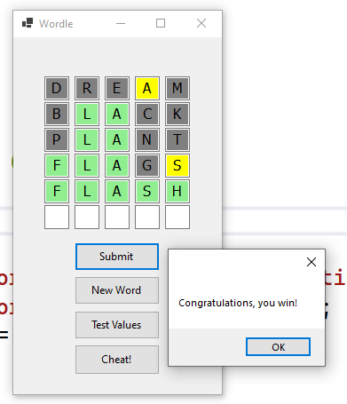

# A Simple WORDLE Clone

## Info

Use at your own risk.  We developed this as a simple class project.

## Instructions

Open and play.  Words are read from file.

## Info

Words are truncated from a list found [here](https://github.com/charlesreid1/five-letter-words/blob/master/sgb-words.txt).

## Example

  
